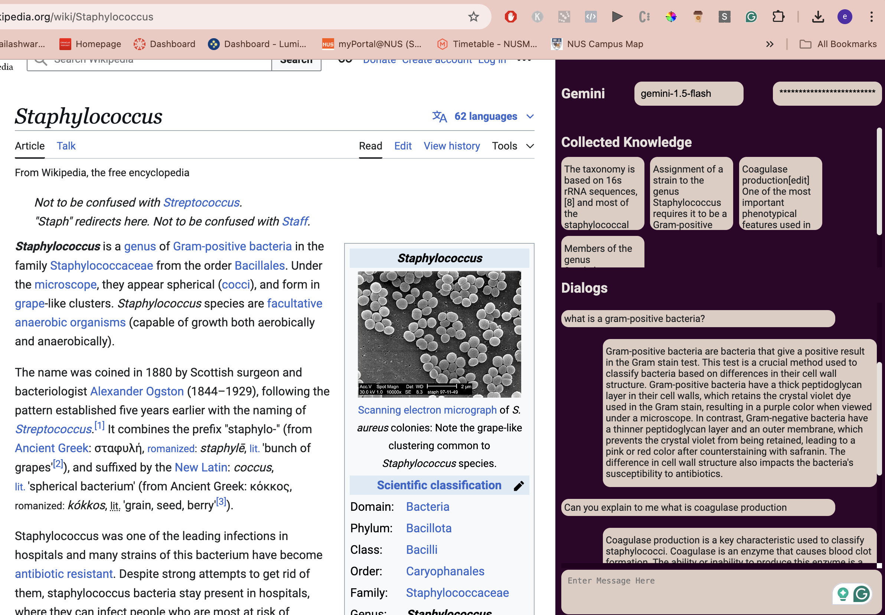

# Chrome Extension: Sidebar LLM Query Assistant

This Chrome extension leverages powerful Large Language Models (LLMs) to enhance your browsing experience. With support for both **OpenAI** and **Gemini** models, users can integrate their own API keys, select their preferred model, and interact seamlessly with LLMs directly from the browser.

The extension functions as a **sidebar tool** that allows users to select text from any webpage to provide context and perform queries based on that context. Whether you're summarizing articles, extracting key information, or asking follow-up questions, this extension makes it easy to utilize advanced AI capabilities while browsing.

---

## Key Features

- **LLM Support**: Currently supports OpenAI and Gemini models, with more to be added in the future.
- **Custom API Key Integration**: Users can securely enter their API key for the chosen LLM service.
- **Model Selection**: Flexibly switch between models based on your needs.
- **Contextual Queries**: Select text directly from a webpage to use as context for your queries.
- **Intuitive Sidebar Interface**: Access the extension quickly from the browser's sidebar for a streamlined workflow.

---

## Installation Guide (Developer Mode)

### Prerequisites

Before installing, ensure you have the following:
- Google Chrome or any Chromium-based browser (e.g., Edge, Brave).
- Access to the `dist` folder containing the built extension files.

### Steps to Install

1. **Open Chrome Extensions Page**
   - Open your Chrome browser.
   - Navigate to `chrome://extensions` by typing it into the address bar and pressing Enter.

2. **Enable Developer Mode**
   - In the top-right corner of the Extensions page, toggle the switch for "Developer mode" to enable it.

3. **Load the Extension**
   - Click the "Load unpacked" button in the top-left corner of the Extensions page.
   - In the file picker dialog that appears, navigate to the `dist` folder from this project and select it.

4. **Verify the Extension**
   - The extension should now appear in your list of installed extensions.
   - Ensure it is enabled by toggling the switch next to it.

---

## Usage Instructions

1. **Open the Sidebar**
   - Click on the extension icon in the browser toolbar to open the sidebar.

2. **Enter Your API Key**
   - In the sidebar, input your API key for either OpenAI or Gemini under the settings tab. This key will allow the extension to interact with the selected LLM.

3. **Enter Your LLM Model**
   - Choose your preferred model by just typing the model name.

4. **Select Text and Query**
   - Highlight any text on a webpage to use it as context.
   - Use the query input box in the sidebar to ask questions or perform tasks related to the selected context.

5. **View Results**
   - The response from the LLM will be displayed directly in the sidebar.

---

## Troubleshooting

- **Missing `dist` folder**: Ensure that the project has been built. If the folder is missing, run the build script for your project (e.g., `npm run build` or `yarn build`) to generate the `dist` folder.
- **No Response from the LLM**: Double-check your API key and model selection. Ensure your API key has sufficient permissions and usage quota.

---

## Contributing
I welcome contributions! If you'd like to help improve this extension, please follow these steps:

1. Fork the repository.
2. Create a new branch for your feature or bug fix.
3. Submit a pull request detailing your changes.

